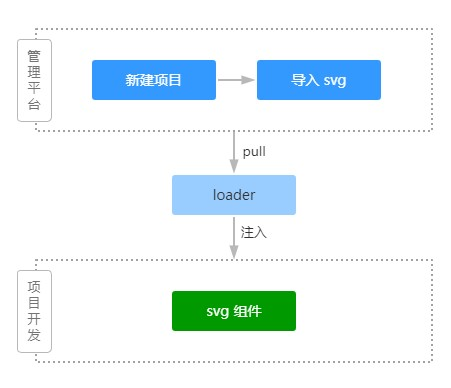

## pineapple 菠萝

> 一个基于 svg 的图标管理和组件化方案

<p align="left>


</p>

整体工作流程分为两步：

1. 管理平台，在这里可以新建一个项目，然后导入需要使用的 svg 图标，当然也能对图标进行增删改查等操作；
2. 项目中使用，在管理平台上的项目都有一个唯一标识 alias，通过这个标识符，可以在项目中使用时只拉取该项目下的图标，避免引入项目以外的图标；为了使图标组件和图标数据集分离，并且能够保证数据有更新后，项目里能够即时同步，需要配置一个 webpack loader，将项目的 alias 传入该 loader，即可实现管理平台上图标有更新后，无需重新构建和发布组件包即可使用到最新的图标；

### Install

```js
npm i pineapple@latest
```

### 使用

支持设置渐变、多色、兼容本地 svg 组件等特性，支持通过配置 webpack loader 自动同步管理平台上的图标数据集，也可以加载本地的图标数据集；

* **基本用法**

```js
import Vue from 'vue';
import SvgIcon from 'pineapple';

Vue.use(SvgIcon, {
  tagName: 'xxx-icon'
});
```

```html
<template>
  <xxx-icon
    name="icon"
    color="red green">
  </xxx-icon>
</template>
```

* Plugin Props

| 名称 | 类型 | 默认值 | 说明 |
| ----- | ----- | ----- | ----- |
| svgIcons | object | - | svg数据集 |
| tagName | string | svg-icon | 组件名 |
| isStroke | boolean | false | 默认使用描边样式 |
| defaultWidth | string | - | 默认宽 |
| defaultHeight | string | - | 默认高 |

* Component Props

| 名称 | 类型 | 默认值 | 说明 |
| ----- | ----- | ----- | ----- |
| rotate | number | false | 旋转角度 |
| spin | boolean | false | 是否添加旋转动画，实现loading效果 |
| icon | string | - | 图标名称 |
| name | string | - | 图标名称 |
| width | string | - | 图标宽 |
| height | string | - | 图标高 |
| scale | number | - | 放大倍数 |
| fill | boolean | true | 使用填充样式 |
| color | string | - | 颜色 |
| title | string | - | 标题 |
| original | boolean | - | 是否使用图标的原色 |

### 使用 webpack loader 自动同步数据集

并修改 webpack 配置，参考：

> 复杂粘贴即可，只需修改 projects
```js
rules: [
  {
    test: /\.js$/,
    loader: 'pineapple/babel-sync-svg-icons-loader',
    options: {
      requestUri: 'http://locale.server',
      projects: 'demo'
    }
  }
]
```

相关配置参数：

| 名称 | 类型 | 默认值 | 说明 |
| ----- | ----- | ----- | ----- |
| requestUri | string | - | 拉取图标数据集的接口 |
| projects | string | common | 项目 alias，多个用逗号隔开 |
| cacheResponse | boolean | true | 是否缓存已拉取过来的图标数据集，为 true 时，当图标有更新后，需要重启应用 |

### 使用 svg2js 生成的 svg 数据集

支持使用包自带的 svg2js 命令将本地的 svg 文件转换成组件可用的数据集；

```js
svg2js assets/svgs --outFile svgs.js
```

### 使用 pull-svg 拉取管理平台上的图标数据

支持使用包自带的 pull-svg 命令拉取管理平台上的图标数据；

```js
pull-svg --projects demo --outFile svgs.js
```

### 使用生成的数据集

```js
import Vue from 'vue';
import SvgIcon from 'pineapple';
import SvgIcons from 'assets/js/svgs.js';

Vue.use(SvgIcon, {
  tagName: 'xxx-icon',
  svgIcons: SvgIcons
});
```

### 集成并优化 svg

优化 svg 信息，删除多余节点，压缩 svg 体积，并将节点信息转为 js，方便统一管理和进一步的优化工作；

```js
const { SvgOptimize } = require('pineapple/scripts/svgo');
const svgo = new SvgOptimize({/* svgo options */});

(async () => {
  /**
   * svgInfo: {
   *  name: string;
   *  data: string;
   *  viewBox: string;
   *  width: number;
   *  height: number;
   * }
   */
  const svgInfo = await svgo.build('svg-filename', 'svg-content');
})();
```